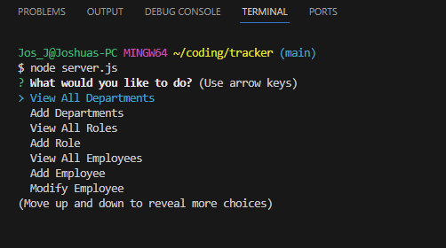

# tracker

## Description

Developers frequently have to create interfaces that allow non-developers to easily view and interact with information stored in databases. These interfaces are called **content management systems (CMS)**. My  assignment  is to build a command-line application from scratch to manage a company's employee database, using Node.js, Inquirer, and MySQL


## Table of contents

- [About](#about)
- [Description](#description)
- [Technologies](#technologies)
- [Installation](#installation)
- [Usage](#usage)
- [License](#license)


## Technologies

- JavaScript
- Node.js
- NPM
- JSON
- Inquirer
- MySQL


## Insatallation

- Install [node.js](https://nodejs.org/en) on your computer. 
- Clone the [Repo](https://github.com/JIF945/tracker), or download the zip file.
- Install NPM
- Run npm install


## Usage
- Run npm install
- Enter npm start or node server.js

- 
  
```
WHEN the application starts you'll be presented with the following options: view all departments, view all roles, view all employees, add a department, add a role, add an employee, and update an employee role
WHEN you choose to view all departments,
You are presented with a formatted table showing department names and department ids
WHEN you choose to view all roles,
You are presented with the job title, role id, the department that role belongs to, and the salary for that role
WHEN you choose to view all employees,
THEN you are presented with a formatted table showing employee data, including employee ids, first names, last names, job titles, departments, salaries, and managers that the employees report to
WHEN you choose to add a department
THEN you are prompted to enter the name of the department and that department is added to the database
WHEN you choose to add a role
THEN you are prompted to enter the name, salary, and department for the role and that role is added to the database
WHEN you choose to add an employee
THEN you are prompted to enter the employee’s first name, last name, role, and manager, and that employee is added to the database
WHEN you choose to update an employee role
THEN you are prompted to select an employee to update and their new role and this information is updated in the database
```
  

  


## About
- [My-Github](https://github.com/JIF945)
- [Email](mailto:joshua.james918@gmail.com) for any questions


## License


